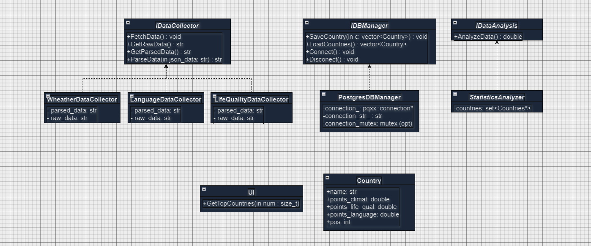

# Country Relocation Ranking System

## Project Overview

The **Country Relocation Ranking System** is designed to help individuals evaluate and rank countries based on various metrics to determine the ease and suitability of relocating. This project gathers and processes data on key factors such as **quality of life**, **climate**, and **language difficulty** to provide an objective ranking of countries for potential movers.

## Features

- **Metrics Collection**: Aggregates data on quality of life, climate conditions, and language difficulty.
- **Country Ranking**: Sorts countries based on the difficulty of relocating, integrating the collected metrics into a comprehensive score.
- **Data Storage and Management**: Utilizes a PostgreSQL database for storing and managing collected data.
- **HTTP Requests**: Employs Boost libraries for making HTTP requests to various APIs for data collection.
- **JSON Parsing**: Uses `nlohmann/json` for handling and parsing JSON data.
- **Testing**: Incorporates Google Test for unit testing to ensure code reliability.
- **Code Style**: https://google.github.io/styleguide/cppguide.html

## Technologies Used

- **pqxx**: C++ library for interacting with PostgreSQL databases.
- **Boost.Beast**: Part of the Boost library used for HTTP requests and handling.
- **nlohmann/json**: A JSON library for C++ used for parsing and manipulating JSON data.
- **Google Test**: A testing framework for C++ used to create and run unit tests.

## Installation

### Dependencies

**Boost** is the only thing that(and compiler of course) *must* be installed in your PC and you also must enter path to it in CMakeLists.txt(str 6) 

### Build Instructions

1. **Clone the repository:**

   ```bash
   git clone https://github.com/yourusername/relocation-ranking-system.git
   cd relocation-ranking-system```
2. **Build**
3. **Run Country Relocation Ranking System**

### Structure
