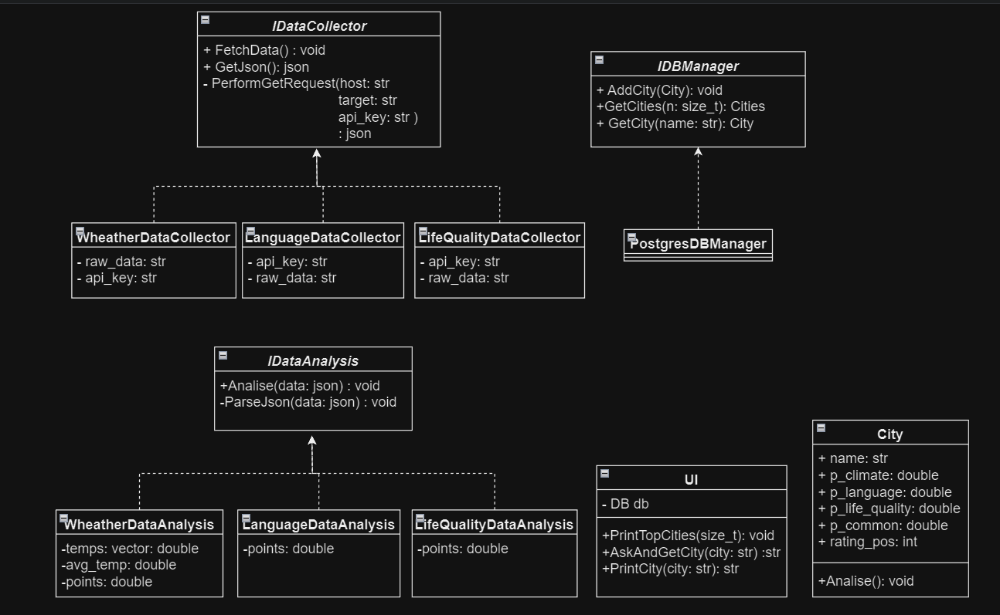

# City Relocation Ranking System

## Project Overview

The **City Relocation Ranking System** is designed to help individuals evaluate and rank cities based on various metrics to determine the ease and suitability of relocating. This project gathers and processes data on key factors such as **quality of life**, **climate**, and **language difficulty** to provide an objective ranking of cities for potential movers.
A user writes the city he wants to know about and gets marks from 1 to 10 which show how good this city is. The result will be saved in DB and will be used in ranking with following cities. 
## Features

- **Metrics Collection**: Aggregates data on quality of life, climate conditions, and language difficulty.
- **City Ranking**: Sorts cities based on the difficulty of relocating, integrating the collected metrics into a comprehensive score.
- **Data Storage and Management**: Utilizes a PostgreSQL database for storing and managing collected data.
- **HTTP Requests**: Employs Boost libraries for making HTTP requests to various APIs for data collection.
- **JSON Parsing**: Uses `nlohmann/json` for handling and parsing JSON data.
- **Testing**: Incorporates Google Test for unit testing to ensure code reliability.
- **Code Style**: https://google.github.io/styleguide/cppguide.html

## Technologies Used

- **pqxx**: C++ library for interacting with PostgreSQL databases.
- **curl**: HTTPS requests and handling.
- **nlohmann/json**: A JSON library for C++ used for parsing and manipulating JSON data.
- **Google Test**: A testing framework for C++ used to create and run unit tests.

## Installation

### Dependencies

**PostgreSQL** *must* be installed in your PC and you must change pathes to dirs in CMakeLists.txt(str 6-7)
*curl**

### Build Instructions

1. **Clone the repository:**

   ```bash
   git clone https://github.com/yourusername/relocation-ranking-system.git
2. **Build**
3. **Run City Relocation Ranking System**

### Structure


